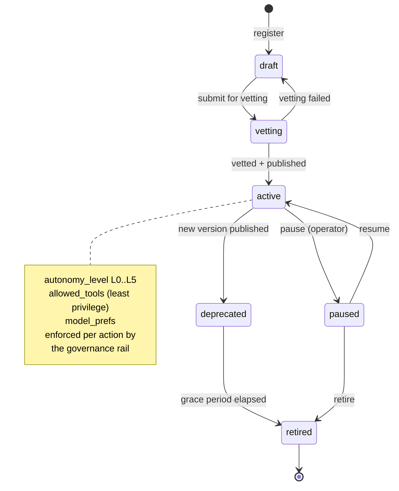

# Agent lifecycle states

Agent definitions are versioned and immutable once published; the registry tracks lifecycle.
Autonomy level L0–L5 is set per agent version and enforced by the governance rail.

## Task-side states (for reference)

`pending → planning → waiting_approval → executing → blocked → completed | failed`,
plus `cancelled` from any non-terminal state. See `task-pipeline.md` and `DATABASE.md` §4.
Every transition is recorded in `task_transitions` and mirrored as an AGRL event.
