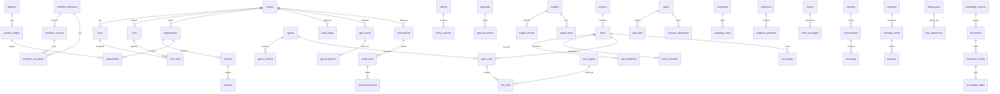

# Data model (ER)

Core entities and relationships. Every table carries `tenant_id` (omitted from the diagram
for readability — see `DATABASE.md` §1). Full column detail: `DATABASE.md`.

```mermaid
erDiagram
    tenants ||--o{ users : has
    tenants ||--o{ roles : defines
    users ||--o{ user_roles : assigned
    roles ||--o{ user_roles : granted

    tenants ||--o{ organizations : owns
    organizations ||--o{ contacts : employs
    pipelines ||--o{ pipeline_stages : has
    organizations ||--o{ opportunities : pursues
    pipeline_stages ||--o{ opportunities : stages
    contacts ||--o{ activities : subject

    projects ||--o{ tasks : contains
    tasks ||--o{ task_transitions : records
    tasks ||--o{ task_comments : discusses

    workflow_definitions ||--o{ workflow_versions : versions
    workflow_definitions ||--o{ workflow_executions : runs
    workflow_versions ||--o{ workflow_executions : pins

    agents ||--o{ agent_versions : versions
    agents ||--o{ agent_runs : executes
    tasks ||--o{ agent_runs : delegated_to
    agent_runs ||--o{ tool_calls : invokes
    tool_registry ||--o{ tool_calls : called_as

    policies ||--o{ policy_versions : versions
    approvals ||--o{ approval_events : tracks

    budgets ||--o{ budget_periods : periods
    budgets ||--o{ spend_alerts : fires
    tasks ||--o{ cost_ledger : costs

    tenants ||--o{ audit_ledger : appends
    tenants ||--o{ agrl_events : appends
    agrl_events ||--o{ agrl_projections : folds_into
    goals ||--o{ goal_links : relates
    goals ||--o{ resource_allocations : funds

    knowledge_sources ||--o{ documents : ingests
    documents ||--o{ document_chunks : splits
    document_chunks ||--o{ knowledge_edges : links

    channels ||--o{ conversations : carries
    conversations ||--o{ messages : contains
    campaigns ||--o{ campaign_steps : steps
    audiences ||--o{ audience_members : includes

    tickets ||--o{ ticket_messages : discusses
    calendars ||--o{ calendar_events : schedules
    calendar_events ||--o{ bookings : books

    tenants ||--o{ subscriptions : billed_by
    billing_plans ||--o{ plan_dimensions : priced_by
    subscriptions ||--o{ credit_pools : grants
    credit_pools ||--o{ credit_transactions : draws
```
