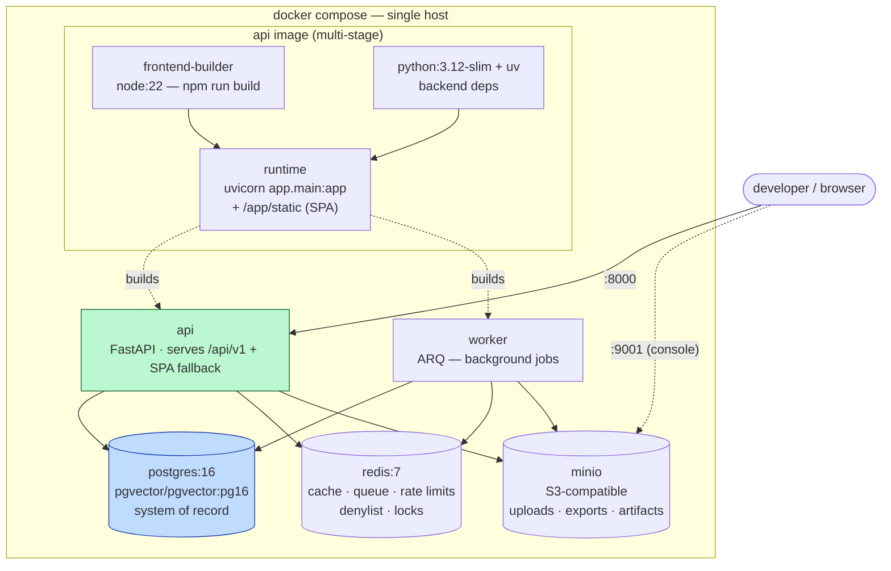

# Deployment topology (docker-compose, local dev)

Target DX: `cp .env.example .env && docker compose up --build`. The frontend SPA is built
into the API image and served same-origin — one artifact, no CORS, cookies work.

## Notes

- Postgres, Redis, MinIO are **not** publicly exposed in production — ports are dev-only.
- Healthchecks gate `api`/`worker` startup on `postgres`/`redis`.
- CI builds the same image (`docker build -t azienda:ci .`).
- Production step-ups (managed Postgres/Redis, object storage provider, TLS at edge,
  OTel collector) are compose/env changes, not code changes. K8s is explicitly deferred (ADR-001).
