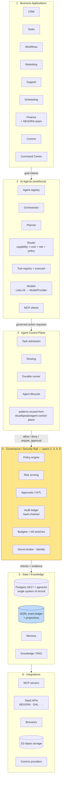

# System spine

The six-layer spine. Layers 1–2 are what Azienda adds; layers 3–6 are seams to existing
systems and patterns (never reimplemented).

```mermaid
flowchart TB
    subgraph L1["1 · Business Applications"]
        CRM[CRM]
        TSK[Tasks]
        WF[Workflows]
        MKT[Marketing]
        SUP[Support]
        SCH[Scheduling]
        FIN[Finance<br/>+ NEXORA seam]
        COM[Comms]
        CC[Command Center]
    end
    subgraph L2["2 · AI Agents (workforce)"]
        REG[Agent registry]
        ORC[Orchestrator]
        PLN[Planner]
        RTE[Router<br/>capability × cost × risk × policy]
        TLS[Tool registry + executor]
        MDL[Models<br/>LiteLLM → ModelProvider]
        MCP[MCP clients]
    end
    subgraph L3["3 · Agent Control Plane"]
        ADM[Task admission]
        AROUT[Routing]
        DUR[Durable runner]
        ALC[Agent lifecycle]
        ACP_PATTERNS["patterns reused from<br/>ekuelkpodar/agent-control-plane"]
    end
    subgraph L4["4 · Governance / Security Rail — spans 2, 3, 5, 6"]
        POL[Policy engine]
        RISK[Risk scoring]
        APR[Approvals / HITL]
        AUD[Audit ledger<br/>hash-chained]
        BUD[Budgets + kill switches]
        SEC[Secret broker · Identity]
    end
    subgraph L5["5 · Data / Knowledge"]
        PG[(Postgres 16/17 + pgvector<br/>single system of record)]
        AGRL[(AGRL event ledger<br/>+ projections)]
        MEM[Memory]
        RAG[Knowledge / RAG]
    end
    subgraph L6["6 · Integrations"]
        MCPS[MCP servers]
        SAAS[SaaS APIs<br/>NEXORA · GHL · …]
        BRW[Browsers]
        S3[(S3 object storage)]
        COMMP[Comms providers]
    end

    L1 -->|goal intents| L2
    L2 -->|governed action requests| L3
    L3 -->|allow / deny / require_approval| L4
    L4 -->|checks + evidence| L5
    L5 --> L6

    style L4 fill:#fde68a,stroke:#92400e
    style AGRL fill:#bfdbfe,stroke:#1e40af
```
