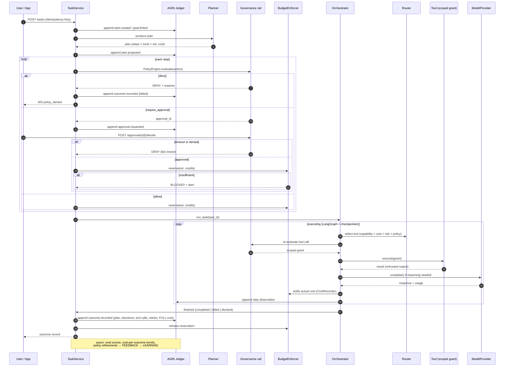

# Governed task pipeline (sequence)

The AI-native operating loop made concrete: every agent-executed task passes through
planning, policy check, budget reserve, durable execution, observation, and outcome recording.
Policy denials and approval timeouts fail closed.

